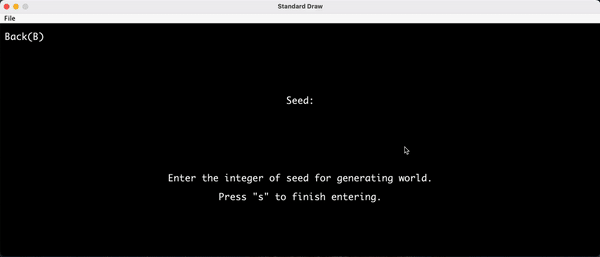

# BYOW (Build Your Own World)

## What is BYOW

This is a game that you generate world by yourself and escape the generated world afterward.

## Demo

## Main Page

The starting point of this game having the following options.

* [New Game](#new_game)
* [Load](#load_game)
* [Quit](#quit_game)

#### New Game

Press `N` to navigate to world generation page, then key in any key in number as seed for randomly generating world.

#### Load

Press `L` if the player had ever used save function in the game. 

#### Quit

Press `Q` to quit game.

## In Game

After generating world or loading previous record, the maze and a character `@`(represent you) appear.
Your goal is to find the treasure(representing in yellow) in the maze, using `W`(up), `S`(down), `A`(left), `D`(right) to move your character.

